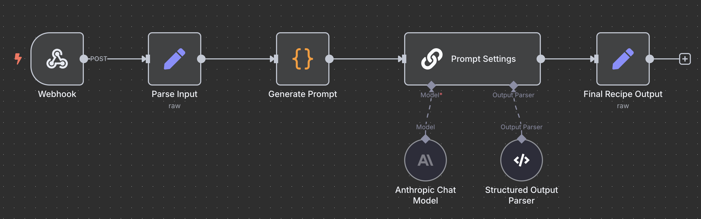

# Recipe Generator

A modern, production-ready Vite + React + TypeScript app for generating and displaying recipes using LLMs.

## Features

- Beautiful UI with Tailwind CSS and shadcn/ui
- Recipe generation via n8n endpoint (configurable)
- Docker-ready for easy deployment

## Workflow Overview - n8n



This project uses an n8n workflow to generate recipes dynamically.

Here's a brief explanation of each component in the workflow:

- **Webhook**: Receives POST requests from the frontend with user preferences (ingredients, cuisine, etc.).
- **Parse Input**: Processes and validates the incoming data.
- **Generate Prompt**: Constructs a prompt for the AI model based on the user's input.
- **Prompt Settings**: Manages the AI model and output parser settings.
  - **Anthropic Chat Model**: The AI model (e.g., Claude) that generates the recipe content.
  - **Structured Output Parser**: Ensures the AI output is structured as valid JSON.
- **Final Recipe Output**: Formats and returns the final recipe JSON to the frontend.

## Example n8n Response JSON

The n8n flow should return a JSON object in the following format:

```json
{
  "recipe": {
    "name": "Honey-Glazed Chicken Teriyaki Bowl with Five-Spice Fried Rice",
    "description": "A vibrant Asian-inspired bowl featuring succulent honey-glazed chicken breast with a gluten-free teriyaki sauce, served over fragrant five-spice fried rice with crisp vegetables. This restaurant-quality dish combines sweet, umami, and aromatic flavors in perfect harmony.",
    "cuisine": "Asian",
    "difficulty": "Medium",
    "prepTime": "15 minutes",
    "cookTime": "15 minutes",
    "totalTime": "30 minutes",
    "servings": 4,
    "ingredients": [
      {
        "item": "chicken breast",
        "amount": "600g",
        "notes": "cut into 2cm cubes"
      },
      {
        "item": "jasmine rice",
        "amount": "300g",
        "notes": "cooked and cooled (preferably day-old)"
      },
      {
        "item": "mixed vegetables",
        "amount": "400g",
        "notes": "bell peppers, carrots, snap peas, and broccoli, cut into bite-sized pieces"
      }
      // ... more ingredients ...
    ],
    "instructions": [
      {
        "step": 1,
        "instruction": "In a small bowl, whisk together ...",
        "time": "2 minutes"
      },
      {
        "step": 2,
        "instruction": "Heat a large wok ...",
        "time": "2 minutes",
        "temperature": "high heat"
      }
      // ... more steps ...
    ],
    "nutrition": {
      "calories": "485 per serving",
      "highlights": [
        "High in lean protein from chicken breast",
        "Rich in vitamins and fiber from mixed vegetables",
        "Provides complex carbohydrates from rice",
        "Contains healthy fats from sesame oil"
      ]
    },
    "tips": [
      "Use day-old rice for the best fried rice texture - fresh rice can become mushy",
      "Keep the wok smoking hot throughout cooking for authentic wok hei (breath of the wok) flavor"
      // ... more tips ...
    ],
    "tags": [
      "gluten-free",
      "quick",
      "healthy",
      "high-protein",
      "one-pan",
      "Asian-inspired",
      "family-friendly"
    ]
  },
  "success": true,
  "timestamp": "2025-07-06T12:23:34.921Z"
}
```

## Getting Started

### Local Development

1. Install dependencies:
   ```sh
   npm install
   ```
2. Create a `.env` file in the project root with your API credentials:
   ```env
   VITE_N8N_ENDPOINT=https://your-n8n-endpoint
   VITE_N8N_USERNAME=your_username
   VITE_N8N_PASSWORD=your_password
   ```
3. Start the dev server:
   ```sh
   npm run dev
   ```
4. Visit [http://localhost:8080](http://localhost:8080)

### Production Build

```sh
npm run build
npm run preview
```

## Docker Deployment

### 1. Build the Docker image

```sh
docker build -t recipe-generator .
```

### 2. Run the Docker container

```sh
docker run -p 8080:80 recipe-generator
```

Your app will be available at [http://localhost:8080](http://localhost:8080).

### 3. Environment Variables

- Set your Vite environment variables in a `.env` file before building, or pass them as build arguments:
  ```sh
  docker build \
    --build-arg VITE_N8N_ENDPOINT=https://your-n8n-endpoint \
    --build-arg VITE_N8N_USERNAME=your_n8n_workflow_username \
    --build-arg VITE_N8N_PASSWORD=your_n8n_workflow_password \
    --build-arg VITE_USERNAME=your_app_username \
    --build-arg VITE_PASSWORD=your_app_password \
    -t recipe-generator .
  ```
- Vite will only pick up environment variables at build time, not at runtime.

## Authentication (Username & Password)

To require a username and password for access, set the following environment variables before building or running the app:

```
VITE_USERNAME=yourusername
VITE_PASSWORD=yourpassword
```

These can be set in a `.env` file at the project root, or in your deployment environment. The sign-in page will use these credentials.

**Note:** For real security, use a backend. This method is only for simple gating, as credentials are visible in the built frontend.
